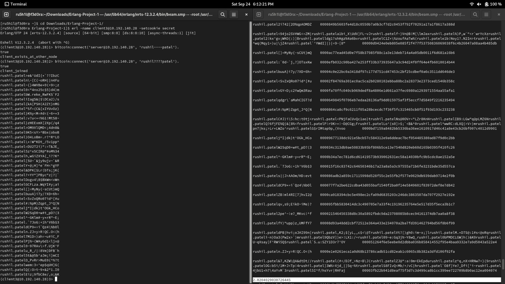

# Project 1

## Problem Definition

Bitcoins (seehttp://en.wikipedia.org/wiki/Bitcoin) are the most popular crypto-currency in common use. At their heart, bitcoins use the hardness of cryptographic hashing (for a reference seehttp://en.wikipedia.org/wiki/Cryptographichashfunction)to ensure a limited “supply” of coins.  In particular, the key component in a bit-coin is an input that, when “hashed” produces an output smaller than a target value.  In practice, the comparison values have leading  0’s, thus the bitcoin is required to have a given number of leading 0’s (to ensure 3 leading 0’s, you look for hashes smaller than0x001000... or smaller or equal to 0x000ff....The hash you are required to use is SHA-256.  You can check your version against this online hasher:http://www.xorbin.com/tools/sha256-hash-calculator. For example, when the text “COP5615 is a boring class” is hashed, the value fb4431b6a2df71b6cbad961e08fa06ee6fff47e3bc14e977f4b2ea57caee48a4 is obtained.  For the coins, you find, check your answer with this calculator to ensure correctness. The goal of this first project is to use Erlang and the Actor Model to build a good solution to this problem that runs well on multi-core machines.
## Steps to run

1. To start the server, go to project folder and change the IP and then run `erl -name server@serverIP -setcookie secret`
2. Then compile the server file - superb.erl `c(superb).`
3. Start the server using `superb:start_server(threshold).` where sample threshold value is 4.
4. To start the client, go to project folder and change the IP and then run `erl -name client@clientIP -setcookie secret`
5. Then compile the client file - superb.erl `c(bitcoin).`
6. Connect client to server with `bitcoin:connect('server@serverIP', clientName).` where each client has a unique name.
7. Start the server using `superb:start_server().
8. Even if the client connects mid computing with the server, the server will print results as it computes and not serially  i.e it will print bitcoins of server and client as it computes.

## Observations 
- We managed to 6 get leading zeros from our 2 machines
- The server is always able to receive connections from any amounts of client. When the client is done computing remotely, the server will display the results of that computation. 
- We have connected 16 clients to a Server and run for the values 4 and 6.
- The work unit size is 20 i.e. we are sending 20 random strings to each client.
- We achieved `2.5356` ratio of CPU time to Realtime for the server.

## Screenshots 

Client and Server computing done in parallel for 6 leading 0s

Client and Server computing done in parallel for 5 leading 0s

Client and Server computing for 4 0s

CPU utilization

## Contributors
- [@raj-vora](https://github.com/raj-vora)
- [@rushilp1](https://github.com/rushilp1)
